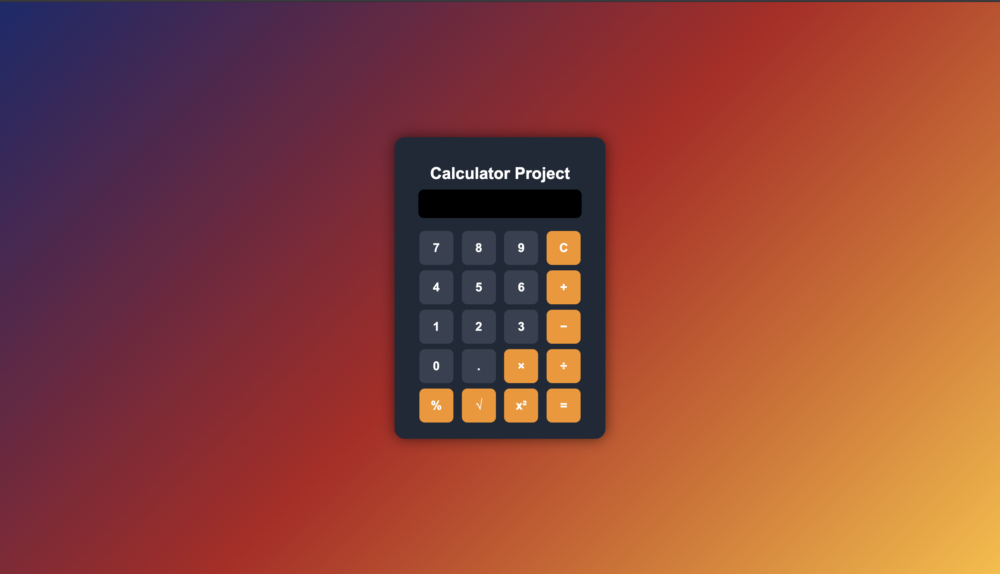

<p align="center">
  
</p>

<h1 align="center">🧮 Advanced Calculator Web App</h1>

<p align="center">
  A clean, fast, and responsive Calculator built using
  <b>HTML, CSS, and JavaScript</b>.
  Perform operations with smooth UI, keyboard support, and error handling.
</p>

<p align="center">
  <a href="https://ciphernomad.github.io/Calculator/"><b>🎮 Live Demo</b></a> •
  <a href="https://github.com/CipherNomad/Calculator"><b>📦 Source Code</b></a>
</p>

<br>

---

## 📌 Tech Stack & Badges

<p align="left">
  
  
  
  
</p>

---

# 📑 Table of Contents

* [📸 Screenshot](#-screenshot)
* [✨ Features](#-features)
* [🚀 Live Demo](#-live-demo)
* [🛠️ Technologies Used](#️-technologies-used)
* [📂 Project Structure](#-project-structure)
* [🔧 Run Locally](#-run-locally)
* [🌍 Deployment](#-deployment)
* [🤝 Contributing](#-contributing)
* [⭐ Support](#-support)

---

## 📸 Screenshot

<p align="center">
  
</p>

---

## ✨ Features

### 🎨 UI / UX

* Clean and modern design
* Responsive layout
* Smooth keypress animations
* Optimized button grid

### 🧮 Functionality

* Basic arithmetic operations (+, -, ×, ÷)
* Decimal support
* Error handling (invalid inputs, division by zero)
* Keyboard input support
* Live expression and result display

### 💾 Storage (Optional Future)

* Dark Mode (coming soon)
* Sound effects
* Calculation history

---

## 🚀 Live Demo

👉 **Use the Calculator instantly:**

### [https://ciphernomad.github.io/Calculator/](https://ciphernomad.github.io/Calculator/)

---

## 🛠️ Technologies Used

| Technology     | Purpose                  |
| -------------- | ------------------------ |
| HTML5          | Base structure           |
| CSS3           | Design + layout          |
| JavaScript ES6 | Logic + DOM manipulation |
| GitHub Pages   | Deployment               |

---

## 📂 Project Structure

```txt
Calculator/
│── images/
│   └── banner.png
│
│── index.html
│── style.css
│── script.js
│── README.md
```

---

## 🔧 Run Locally

### 1️⃣ Clone the repository

```bash
git clone https://github.com/CipherNomad/Calculator.git
```

### 2️⃣ Enter the project directory

```bash
cd Calculator
```

### 3️⃣ Run the app

Just open the file:

```diff
index.html
```

✔ Works in any browser
✔ No dependencies needed

---

## 🌍 Deployment

Live URL:

### [https://ciphernomad.github.io/Calculator/](https://ciphernomad.github.io/Calculator/)

To update your live build:

```bash
git add .
git commit -m "update"
git push
```

---

## 🤝 Contributing

Contributions are welcome!
Feel free to open an issue or submit a pull request.

---

## ⭐ Support

If you find this project useful, please ⭐ **star the repository**.
Your support motivates further development! 🙌

<br>
##  📸 Screenshots

<p align="center">
  
  <br><br>
  
</p>

<br>
<p align="center"> Made with ❤️ by <b>Rahul Raj Singh</b> </p>
